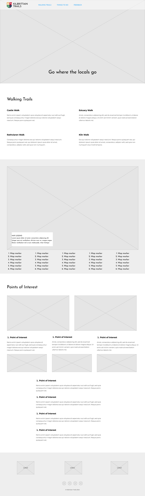
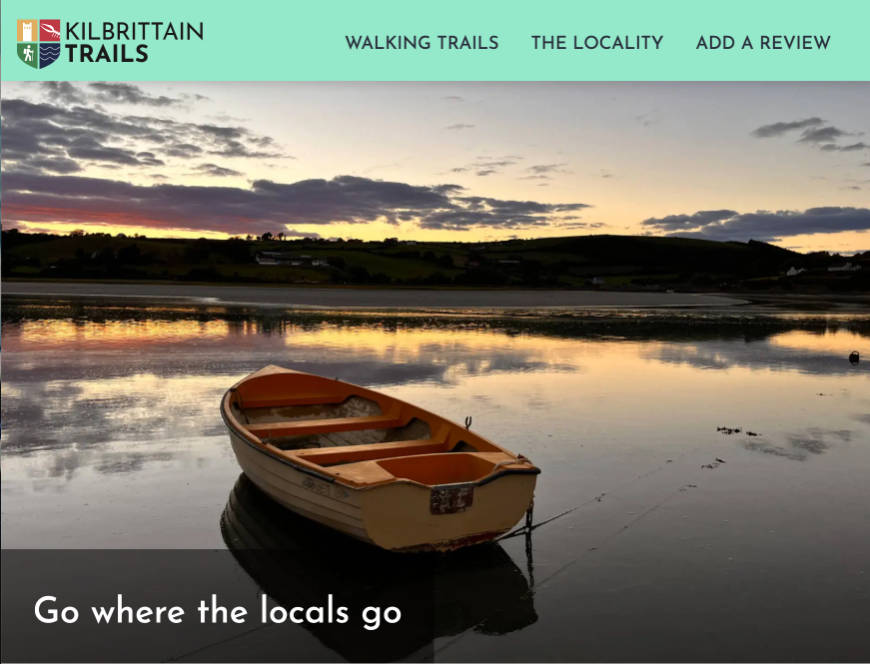
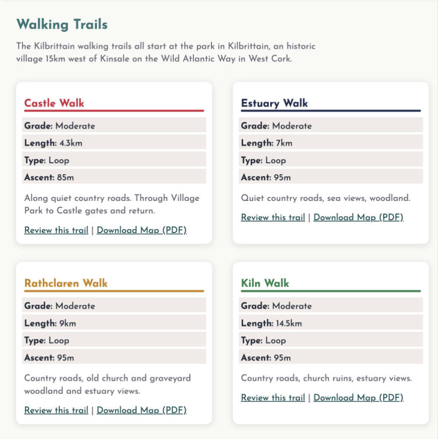
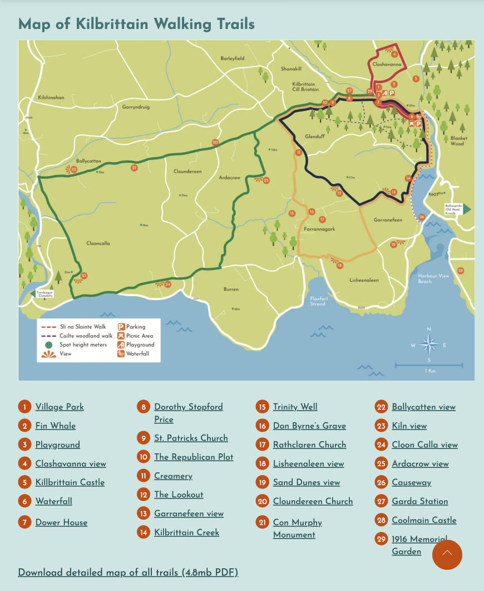
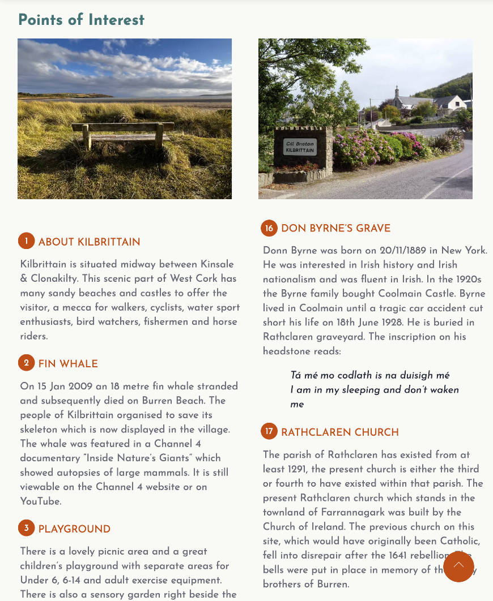
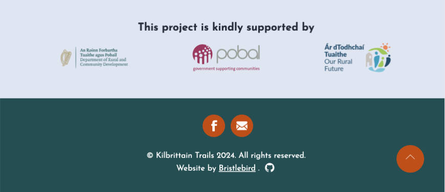

# Kilbrittain Trails

Kilbrittain Trails is a community lead initiative that has developed a series of walking trails in and around the village of Kilbrittain and Courtmacsherry bay, a designated Special Area of Conservation (SAC) in West Cork that's renowned for its outstanding natural beauty and rich historical significance. Originally conceived as a printed leaflet that was supported by the Department of Rural and Community Development with funding from Pobal and Our Rural Futures, the Kilbrittain Trails website aims to promote the benefits of the area to a wider audience than might otherwise be reached through print. 

As a community initiative, the website is primarily targeted at local and surrounding communities with the objectives of promoting healthy activity and lifestyle through walking, developing an appreciation of nature and raising awareness of the areas' rich and colourful history. 

Additionally, the site is targeted at tourists exploring West Cork's Wild Atlantic Way, with the aim of encouraging them to stay in and explore the locality. The site aims to achieve this by highlighting various local attractions and amenities useful to visitors from outside the area.

### Wireframes  

Wireframe - Homepage Desktop
  

 

## Features 

In this section, you should go over the different parts of your project, and describe each in a sentence or so. You will need to explain what value each of the features provides for the user, focusing on who this website is for, what it is that they want to achieve and how your project is the best way to help them achieve these things.

### Existing Features

- __Navigation Bar__

  - This navigation bar is persistent and identical across all pages, is fully responsive across all screen sizes providing easy site navigation by using bright colours with high contrast legible links.  It remains fixed on scroll so that the user always has quick and easy access to all pages on the site.

- __The Hero image__

  - This features a large captivating image of a boat at sunset on the water in Kilbrittain Estuary with a tagline that suggests that there are hidden wonders to be discovered by walking the Kilbrittain trails. The purpose is to give the visitor a sense of the scenic coastal location.

- __Walking Trails Section__

  - This provides the details and descriptions of each of the waymarked walks which are colour coded to the map below. Each walk detail encourages walkers to review the trail if they've walked it by featuring a link to the review page which automatically selects the chosen trail from the dropdown. A pdf download link to each indivdual trail map provides further detail.

- __Overview map & Points of interest section__

  - This section displays an overview map of all the trails with detailed points of interest to be found along the way. Numbered markers link to further detail and a description of each point of interest below. A link to a larger PDF version of the overview map.

- __The Footer__ 

  - The footer section includes logos of the organisations involved in supporting the development of Kilbrtittain trails and also links to the Kilbrittain Trails Facebook page and a contact email address. The email address is obfuscated to make it more difficult for spam bots to scrape. 
  - The Facebook page is run by the Kilbrittain Tidy Towns community of a voluntary basis and is a great source of news for local festivals and events, which is very useful to both the local community and visitors to the area. 

- __The Locality Page__

  - This page provides a list of local activities and amenities in the vicinity of Kilbrittain that will be useful to visitors, i.e. things to do, places to stay, eat and drink, choice of nearby beaches and transport. 

- __The Add a Review Page__

  - This page allows walkers to submit a review and a star rating for individual walks. They can select the walk to review from the dropdown menu if not already preselected when they visit this page via the 'Review this trail' links in Walking Trails section of the home page. The walker is also asked to submit their name and country of origin for the review. A future feature would be to display a curated selection of reviews on the site. Their email address could also be collected if required for verification. Handling such personal data would require a privacy policy to comply with GDPR regulations.

### Features Left to Implement

- Display a selection of submitted reviews on the site.
- Add a gallery page to display more images of the scenic locality.
- Add further images and a lightbox viewer to allow the visitor to view images more easily. 

## Testing 

In this section, you need to convince the assessor that you have conducted enough testing to legitimately believe that the site works well. Essentially, in this part you will want to go over all of your project’s features and ensure that they all work as intended, with the project providing an easy and straightforward way for the users to achieve their goals.

In addition, you should mention in this section how your project looks and works on different browsers and screen sizes.

You should also mention in this section any interesting bugs or problems you discovered during your testing, even if you haven't addressed them yet.

If this section grows too long, you may want to split it off into a separate file and link to it from here.

### Validator Testing 

- HTML
  - No errors were returned when passing through the official [W3C validator](https://validator.w3.org/nu/?doc=https%3A%2F%2Fbristlebird.github.io%2Fkilbrittain-trails%2F)
- CSS
  - No errors were found when passing through the official [(Jigsaw) validator](https://jigsaw.w3.org/css-validator/validator?uri=https%3A%2F%2Fbristlebird.github.io%2Fkilbrittain-trails&profile=css3svg&usermedium=all&warning=1&vextwarning=&lang=en) 

### Web Perfomance

All pages on the site achieve 100/100 on all Google Lighthouse Page speed:
- Home page: https://pagespeed.web.dev/analysis/https-bristlebird-github-io-kilbrittain-trails/nq2wx9ge27?form_factor=mobile
- Locality page: https://pagespeed.web.dev/analysis/https-bristlebird-github-io-kilbrittain-trails-locality-html/5vlozswd4o?form_factor=mobile
- Submit a review page: https://pagespeed.web.dev/analysis/https-bristlebird-github-io-kilbrittain-trails-submit-review-html/83tqlxr5cf?form_factor=mobile

### Unfixed Bugs

You will need to mention unfixed bugs and why they were not fixed. This section should include shortcomings of the frameworks or technologies used. Although time can be a big variable to consider, paucity of time and difficulty understanding implementation is not a valid reason to leave bugs unfixed. 

## Deployment

This site has been deployed to Github pages from the master branch of this repository. 
The live link can be found here - https://bristlebird.github.io/kilbrittain-trails/ 

## Credits 

### Design credits
- Color namer by Chirag Mehta: https://chir.ag/projects/name-that-color/ — used to name hex colors in css custom properties
- Favicon created with: https://favicon.io/favicon-converter/
- Josefin sans Webfont generated by Font Squirrel: https://www.fontsquirrel.com

### Code credits
- reset.css: https://piccalil.li/blog/a-more-modern-css-reset/ — A more modern css reset by Andy Bell.
- Email obfuscation: https://www.albionresearch.com/tools/obfuscator — makes it harder for spambots to scrape email address from the page.
- Pure css & html star rating: https://github.com/mukulkant/Star-rating-using-pure-css
- Countries select dropdown: https://gist.github.com/danrovito/977bcb97c9c2dfd3398a - simple select list of all countries of the world (review page).
- Using CSS Counters for Custom List Number Styling: https://css-tricks.com/css-counters-custom-list-number-styling/
- Using grid instead of containers/ wrappers: https://codepen.io/kevinpowell/pen/ExrZrrw / https://www.youtube.com/watch?v=c13gpBrnGEw
- Code Institute Love Running mobile navigation checked input dropdown: https://github.com/Code-Institute-Org/love-running-2.0
- 5 star rating radio buttons: https://codepen.io/hesguru/pen/BaybqXv

### Content 
- All content is courtesy of Annette Hickey, [Kilbrittain Trails](https://www.facebook.com/kilbrittaintidytowns).

### Media
- Logo & maps: from the [Kilbrittain Trails brochure PDF](), kindly provided by Annette Hickey of Kilbrittain Trails.
- Photos: The photos used on this site are from the Kilbrittain Trails brochure and a variety of plaques on the walks, courtesy of Cathy Moir, Annette Hickey and Peggy Larkin.
